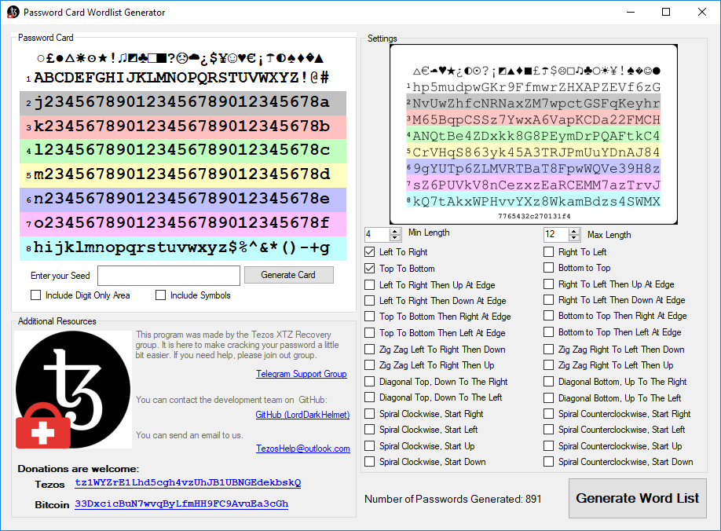
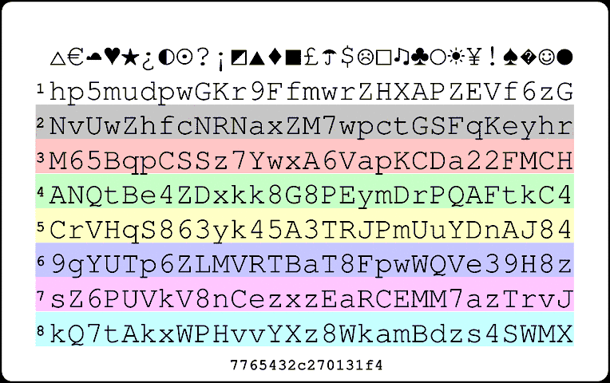

# Password Card Word List Generator

If you have a password card (https://www.passwordcard.org/) you can generate a word list to assist in finding lost passwords.  

## Getting Started

This application runs on Windows. Just download and use the installer.

The UI is easy to use and all on one page. You can edit each line of your password card manually, or you can type in the seed.

Once you have properly put in your seed or manually entered your information, you can now use the settings. 
 <i>A live count of the number of passwords can be found at the bottom</i>

### Settings

There are two types of settings. The size of the produced words, and the method to get the words.

The size of the words can be adjusted using the min and max length number boxes.

There are lots of methods to choose from! Put your mouse over each check box to view what the method does.

### Tips

Dictionary attacks using a tool like [John The Ripper](https://www.openwall.com/john/) should be very quick. If you are unable to crack your password try the following:

- Use a rule to check for caps lock
- Use a mask to add leading or following characters
- Contact us for assistance. Sometimes it is easier to ask then to struggle. 

## Need More Assistance?

This application was requested by members of the Tezos XTZ Recovery Telegram Group.  
For Tezos recovery assistance please visit: https://t.me/xtzrecovery 

Feel free to contact me for requests or assistance

### Donations are welcome:
BTC:   33DxcicBuN7wvqByLfmHH9FC9AvuEa3cGh  
Tezos: tz1WYZrE1Lhd5cgh4vzUhJB1UBNGEdekbskQ
